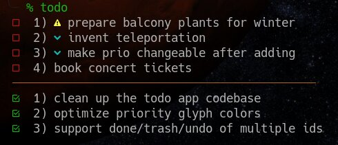

# zsh commandline todo manager

This is a todo list manager for zsh. It was born out of curiosity and
wanting to learn coreutils.

## usage

* `todo.zsh`                        prints current open and completed todos
* `todo.zsh add some task`          adds 'some task' as open todo
* `todo.zsh clean`                  clears completed todos off the list
* `todo.zsh done N`                 marks the Nth todo as completed
* `todo zsh rename N new descr.`    renames Nth open task to 'new descr.'
* `todo.zsh trash N`                deletes the Nth open todo
* `todo.zsh undo N`                 marks the Nth completed todo as not done

You can mark a task as high priority by including `:high:` somewhere
in the task name. Similarily you can mark a task as low priority by
adding `:low:` somewhere in the task name.

The operations `done`, `undo` and `trash` support multiple ids, separated by spaces.

Shorthands for all operations exist: `todo u 1 3 4` is equal to `todo undo 1 3 4`.

## requirements

Currently this requires zsh due to how I handle colors in the script.
The zsh color syntax was chosen for convenience, you can replace it with
color escape codes and get rid of the color autoloading.

It also requires a nerdfont for glyphs. You can change the glyphs to 
ASCII by replacing the `G` variable. 

## setup 

Both open and completed todos are stored in text files. I do recommend
creating a directory like `~/.todos` manually and changing the `FILE_DIR`
variable to an absolute path. Files will be automatically created if they
don't exist.

You might also want to symlink the `todo.zsh` script to `~/.local/bin/todo`
or another directory in your `PATH` for ease of access.

## upgrading

As always, it is good practice to make backups of the `todo.txt` and `done.txt`
files before upgrading this application.

I've changed the way the content of both tiles is interpreted after v1.0.0:
If you upgrade from v1.0.0 or earlier, an upgrade works fine if you `todo.zsh clean`
before the upgrade. Otherwise your done tasks appear in both lists, but another
`todo.zsh done N` for those will fix it.

